# PAM guide

Guide for assessment and user management through the backend.

## In general

### Overview

* Clicking any of the secondary menu items will take you to an overview page of the selected item type. E.g. clicking `Tool`>`Assessments`

  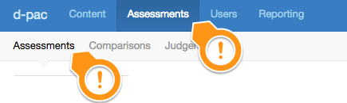

  Will show you an overview of all existing assessments.
  
  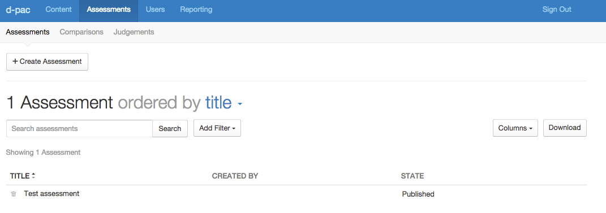

* Item deletion: **Coming soon**
* Item editing: click on the value in the first column of the overview:

  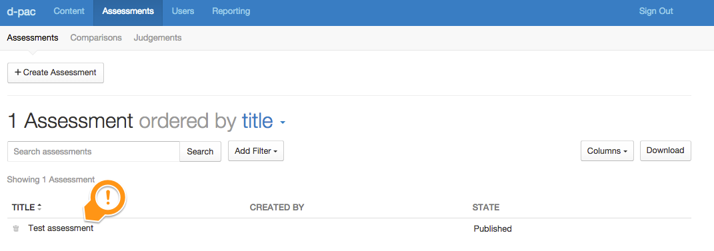
  
  Will take you to the item specific editor:
  
  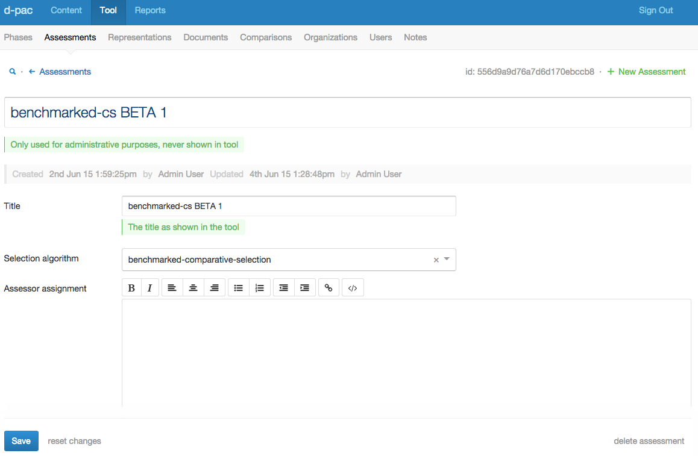
  
### Interface elements

Most interface elements are common in both outlook and behaviour, however there's some tips and tricks:

* I you want to remove a value from a selection box, click the small `x`-mark:

  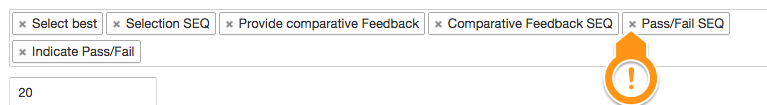

* If you have selected a value in a drop-down list, but you want to deselect it (without selecting another one) click the small `x`-mark:

  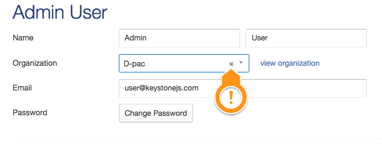
  
  If no `x`-mark is shown, it means a value **is required**.
  
## Adding Assessments

### Create Assessments

1. Click on `Tool`>`Assessments`>`Create Assessment`

  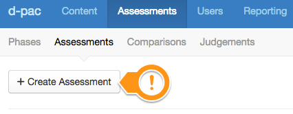

1. This will allow you to create the assessment and add essential details in-place:

  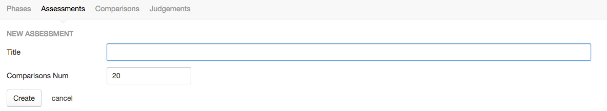
  
1. However, it's not over yet. This simply created the `Assessment`, but if you wish to fill in more of its fields, you'll have to do this in the `Assessment` editor:

  

  * __Title__: This is the title as it will appear in the tool in various places:

  	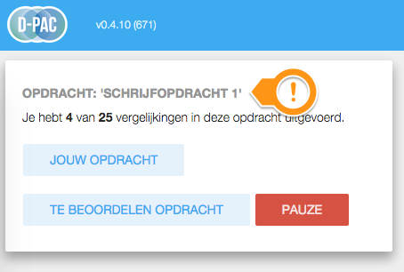

  * __Selection algorithm__: Please select which selection algorithm you wish to use.
  
  * __Assessor assignment__: Please fill out a clear and concise description of the assessor assignment. This will appear in the tool as:
    
    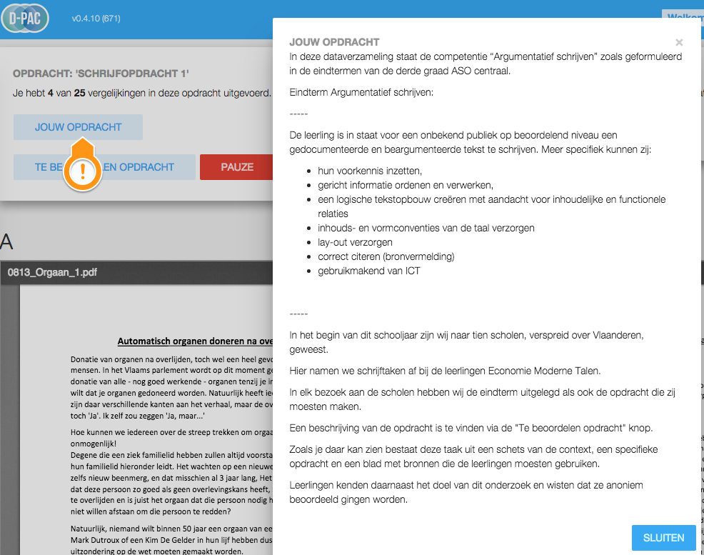  

  * __Assessee assignment__: Please fill out a clear and concise description of the assessee assignment. This will appear in the tool as:

    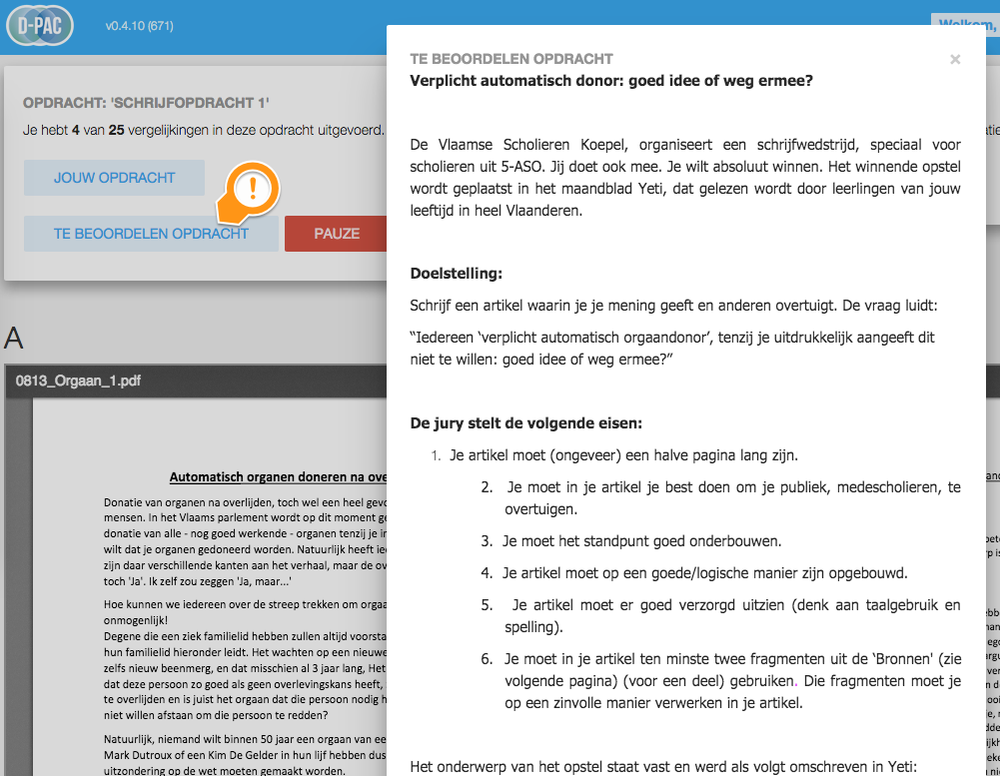  

  * __Workflow__: These define the various steps the assessor will need to perform in one comparison. 

  * __Total number of comparisons__: Define the maximum number of comparisons.

  * __Number of comparisons wanted per stage__: Define the maximum number of comparisons, per assessor, per stage.

  * __State__: By default an `Assessment` is in a "draft" state. This means that assessors **will not** be able to select this assessment for comparisons. It is useful to allow the PAM to create an assessment up-front and fill in the details over a period of time, without showing up in the assessment selection screen of the tool. **Select "published" once you're done with an assessment and want to enable it in the tool**:

  * __After__: Allows you to setup a hierarchy of assessments. If you select another assessment in this field, the current assessment will only be shown to the assessors _after_ the selected assessment has been completed.
  
  * __Algorithm stage__: Specific algorithms need to maintain what stage they're in. Modify at your own risk!

  * __Enable time logging__: toggles time logging for this assessment.

  * __UI Texts__: allos you to modify the texts as presented in the tool.

## Adding Organisations

First of all we need to make sure the necessary `Organisation`s are added:

1. Click on `Tool`>`Organisations`>`Create Organization`

1. Fill out the details
  
  

## Adding Assessors

Next we need to **create a `user` for each assessor**:

1. Click on `Tool`>`Users`>`Create User`

1. Fill out the details:
 
  * __Name__: First and last name

  * __Organisation__: Select an organisation from the list or leave it blank.

  * __Email__: Must be a valid e-mail address (but not necessarily an existing one)

  * __Password__: Click 'Change password' and fill out the new password twice.

  * __Assessments__: Add a user as an assessor to specific assessments; select any number of assessments you want from the list

  * __Can access keystone__: This will grant the user administrative rights. **Do not tick this unless for team members!**
  
## Adding Representations

Creating a `representation` for an assessee is a two-phased process:

### Create the `document`

1. Click on `Tool`>`Documents`>`Create Document`
 
1. This opens a modal form :
 
  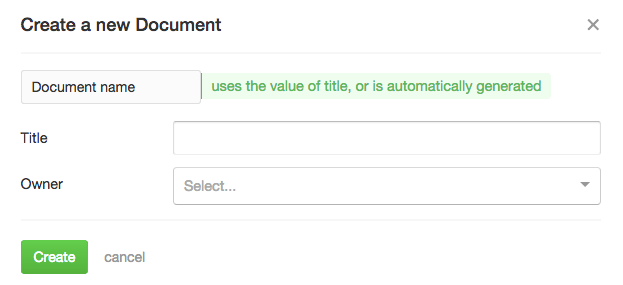

  * __Title__: Optional, you can give it a title, otherwise the filename will be used.

  * __Owner__: Optional, select the user that created the document or leave blank.

  Clicking 'Create' creates the document, next you need to upload the file.

1. Documents can be 'local' (residing on "our" server) or 'remote' (residing some place else), click "upload file" to select a file from your hard disk.

1. Or, paste a URL in "External file" to use a "remote" file.

### Create the `representation`

A representation is the link between a document and an assessment. (I.e. a single document can be used in multiple assessments.)

1. Click on `Tool`>`Representations`>`Create Representation`
 
1. This opens a modal form :
 
  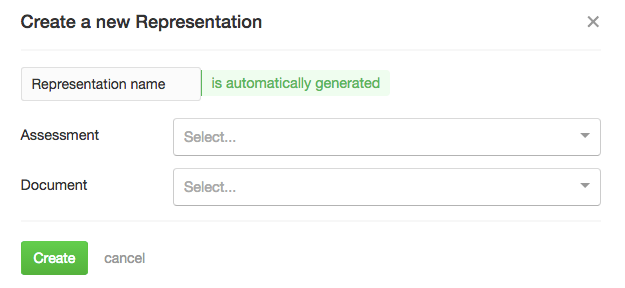

  * __Assessment__: Select the assessment you want to link the document to.

  * __Document__: Select the document you want to use in the assessment.

  Clicking 'Create' creates the representation.

1. Next you might need to fill out some details, depending on the algorithm you chose:

  * __Ability value__

  * __Ability SE__

  * __Rank type__

  * __Close to__