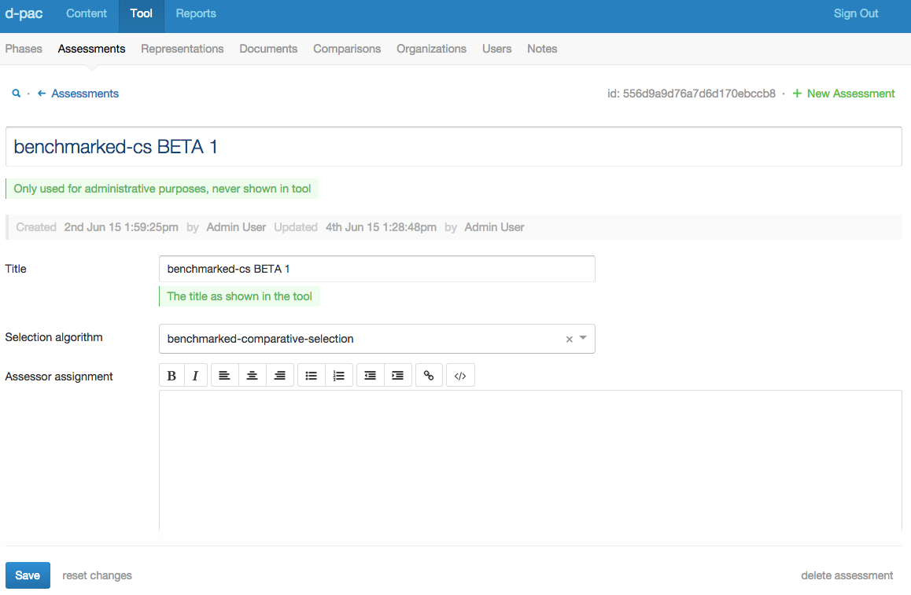
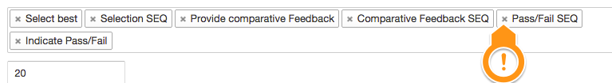
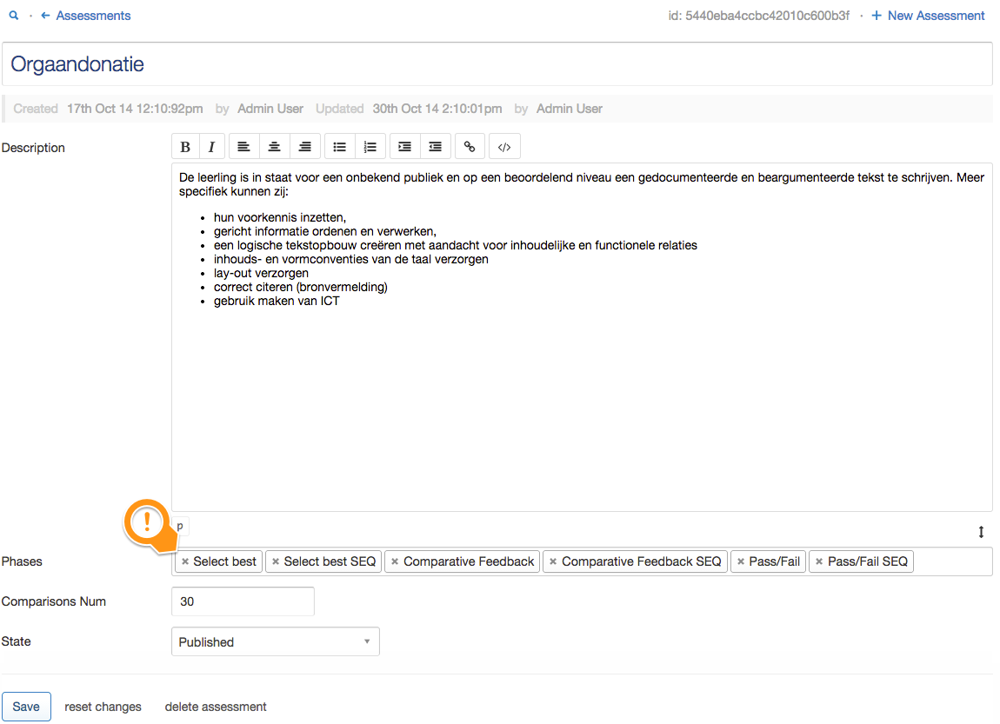
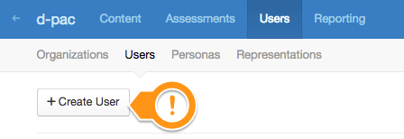
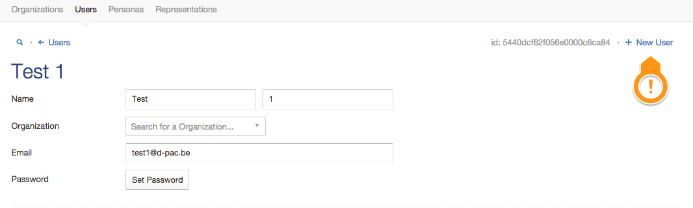
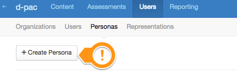
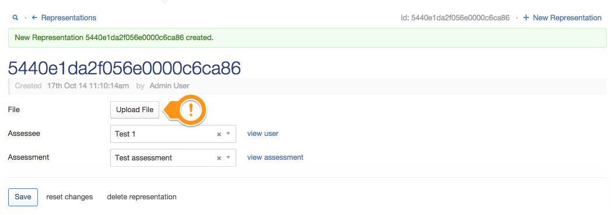
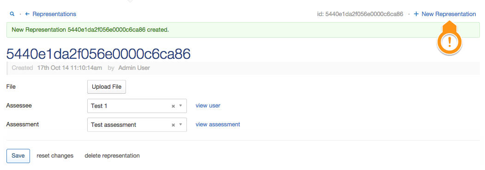

# PAM guide

Guide for assessment and user management through the backend.

## In general

### Overview

* Clicking any of the secondary menu items will take you to an overview page of the selected item type. E.g. clicking `Assessments`>`Assessments`

  

  Will show you an overview of all existing assessments.
  
  

* Item deletion: **Coming soon**
* Item editing: click on the value in the first column of the overview:

  
  
  Will take you to the item specific editor:
  
  
  
### Interface elements

Most interface elements are common in both outlook and behaviour, however there's some tips and tricks:

* I you want to remove a value from a selection box, click the small `x`-mark:

  

* If you have selected a value in a drop-down list, but you want to deselect it (without selecting another one) click the small `x`-mark:

  
  
  If no `x`-mark is shown, it means a value **is required**.
  
## Adding Assessments

### Create Assessments

1. Click on `Assessments`>`Assessments`>`Create Assessment`

  

1. This will allow you to create the assessment and add essential details in-place:

  
  
1. However, it's not over yet. This simply created the `Assessment`, but if you wish to fill in more of its fields, you'll have to do this in the `Assessment` editor:

  
  
  * __Description__: Please fill out a clear and concise description of the assessment. This will appear in the tool as:
    
      

  * __Phases__: These define the various steps the assessor will need to perform in one comparison. At the moment, all phases should be included, **in the exact same order as below**:
  
    

  * __Comparisons Num__: Define the number of comparisons each assessor needs to make in an assessment.
  * __State__: By default an `Assessment` is in a "draft" state. This means that assessors **will not** be able to select this assessment for comparisons. It is useful to allow the PAM to create an assessment up-front and fill in the details over a period of time, without showing up in the assessment selection screen of the tool. **Select "published" once you're done with an assessment and want to enable it in the tool**:
  
    

## Adding Assessees and their representations

### Create Organisations

First of all we need to make sure the necessary `Organisation`s are added:

1. Click on `Users`>`Organisations`>`Create Organization`

  

1. This will allow you to create the organisation in-place
  
  

1. Clicking the `Create`-button will take you to the `Organisation` editor. To create another `Organisation`, use the shortcut:
  
### Creating Users

Next we need to **create a `user` for _each_ assessee**:

1. Click on `Users`>`Users`>`Create User`

  
  
1. Again, creating a `User` happens in-place:
 
  

  All fields are mandatory, except for `Organization`. The e-mail address **has to be unique** in the database.
  
1. Clicking the `Create`-button will take you to the `User` editor. To create another `User`, use the shortcut:

  

### Creating Personas

Next we need to define what `role` a `user` has in an `assessment`. Any user can perform different roles in different assessments, hence we need to explicitly declare this.

**Create a `persona` for _each_ assessee`**

1. Click on `Users`>`Personas`>`Create Persona`

  
  
1. In-place provide the details:
  
  

  **All fields are mandatory**
  
1. Clicking the `Create`-button will take you to the `Persona` editor. To create another `Persona`, use the shortcut:

  
  
### Creating Representations

Creating a `representation` for an assessee is a two-phased process:

#### Create the `representation`

1. Click on `Users`>`Representations`>`Create Representation`
 
  

1. In-place link it to a `User` and `Assessment`:
 
  

#### Upload the file

> **PLEASE DO NOT FORGET THIS STEP**

1. Clicking the `Create`-button will take you to the `Representation` editor. Here we need to upload the representation file:

  
  
  Clicking `Upload` will open an operating system specific file browse dialog. E.g. on Mac OS X:
  
  

1. Select the file on your file system you wish to upload and click `open` (or a similar button, depending on your operating system)

1. This will take you back to the `Representation` editor. **We still need to confirm the upload of the file by clicking the `Save`-button!!**:

  
  
1. To create another `Representation`, use the shortcut:

  
